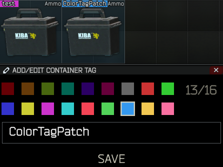
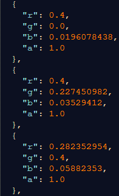
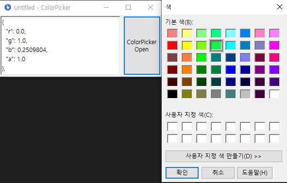

# Untitled - ColorTagPatch Plugin

## 플러그인 정보 (`24.05.07 Update)

* SPT-AKI 3.8.1 

* EFT 0.14.1.29197

---

### 해당 플러그인은 컨테이너 Tag 에서 선택할 수 있는 색상을 추가하는 모드입니다.




```
업데이트로 색상 Config가 추가되었습니다.
'BepInEx\config\ColorList.json' 해당 파일을 수정하시면 됩니다.
```



```
편의를 위해 아래 프로그램도 같이 배포합니다.

해당 프로그램에서 색을 선택후 확인을 누르면 자동으로 Config에 넣을 수 있는 json으로 만들어줍니다.

Config에 넣으실때 json형식을 꼭 지키셔야 됩니다. ( 콤마 확인 잘하셔야 합니다.)
```



만약 프로그램이 의심되신 다면 계산 방법을 적어두겠습니다.

예를 들어 R=123, G=213, B=123

123/255 = 0.482352941
213/255 = 0.835294117
123/255 = 0.482352941
이런 식으로 계산후 아래와 같이 작성하셔서 Config에 추가해주시면 됩니다.
```
  {
    "r": 0.482352941,
    "g": 0.835294117,
    "b": 0.482352941,
    "a": 1.0
  },
```
---

[모드 다운로드](https://github.com/Untitled0828/Mods/raw/main/ColorTagPatch/File/ColorTagPatch_3.8.1.7z "SPT-AKI 3.8.1 버전 대응 플러그인")


[](https://hits.seeyoufarm.com)