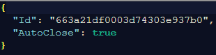
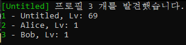
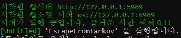

# Untitled - Simple Launcher

## 프로그램 정보 (ver 1.0.0.0)

* 활성화시 게임 우측 하단에 킬 로그가 출력됩니다.

---

Config

`user\launcher\UntitledConfig.json`

---

프로필 번호를 입력하여 사용할 계정을 선택합니다. (추후 실행시 해당 계정으로 자동실행)

서버가 준비되면 지정한 계정으로 클아이언트를 실행합니다.

---

[런처 다운로드](https://github.com/Untitled0828/Mods/raw/main/SimpleLauncher/File/SimpleLauncher-1.0.0.0.7z "SPT-AKI SimpleLauncher Download")
