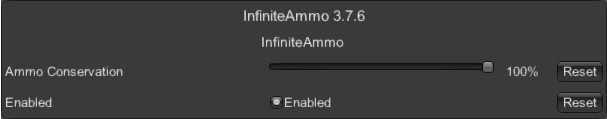

# Untitled - infiniteAmmo Plugin

## 플러그인 정보

* 해당 플러그인은 제작자가 총관련 테스트할때 귀찮아서 만들었습니다.

* Config 에서 Ammo Conservation 을 1로 설정할시 총알 소모를 안합니다.

* 만약 0.5로 설정한다면 50% 확률로 총알 소모를 한합니다.

---

Config

---

[모드 다운로드](https://github.com/Untitled0828/Mods/raw/main/infiniteAmmo/File/infiniteAmmo-3.7.6.7z "SPT-AKI 3.7.6 버전 대응 플러그인")
